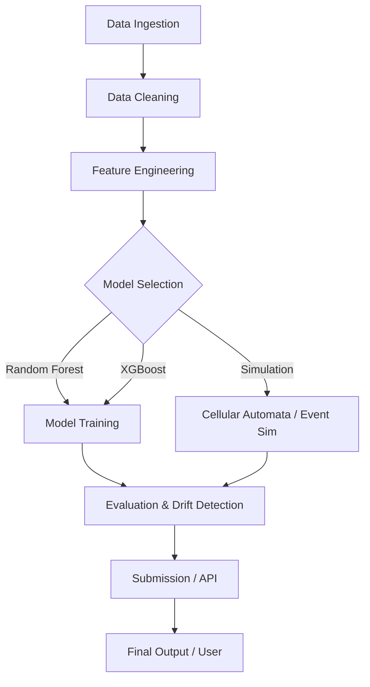

# Microenterprise Density Prediction System
## Systems Analysis & Design (2025-III) - Final Course Project

### Project Overview
This project is an advanced engineering system designed to model and forecast **microenterprise density** (microbusinesses per 100 people) in US counties. It integrates **Machine Learning** (Random Forest, XGBoost) with **Complex Systems Simulation** (Cellular Automata) within a robust **8-layer architecture**.

## Architecture Diagram


### Architecture
The system follows a modular 8-layer architecture:
1. **Data Ingestion**: Loading Kaggle datasets (`train.csv`, `test.csv`, `census_starter.csv`).
2. **Data Cleaning**: Outlier detection, interpolation, and validation (`src/preprocessing.py`).
3. **Feature Engineering**: Lag features, rolling means, and census integration (`src/feature_engineering.py`).
4. **Predictive Modeling**: Adaptive ML models (RF, XGBoost) (`src/model_training.py`).
5. **Ensemble & Calibration**: Model selection and parameter tuning.
6. **Evaluation**: RMSE, MAE, and Drift Detection (`src/evaluation.py`, `src/drift_detection.py`).
7. **Simulation**: 
   - **Cellular Automata**: 50x50 grid predicting density clusters (`src/cellular_automata.py`).
   - **Event-Based**: Simulating economic shocks (`src/event_simulation.py`).
8. **Deployment/API**: End-to-end pipeline connector (`src/api_connector.py`).

### Directory Structure
```
/Final_Project
    /data               # Input datasets (train.csv, test.csv, census_starter.csv)
    /src                # Source code
        preprocess.py   # Data cleaning
        feature_eng.py  # Feature generation
        model_training.py # ML training
        evaluation.py   # Metrics
        drift_detect.py # KS Test
        cellular_automata.py # Simulation
        api_connector.py # Main pipeline
        utils.py        # Utilities
    /notebooks          # Jupyter notebooks for EDA and Demos
    /outputs            # Generated predictions and logs
    README.md           # This file
```

### Installation
1. Clone the repository.
2. Install dependencies:
   ```bash
   pip install pandas numpy scikit-learn xgboost matplotlib
   ```
3. Ensure data files are in `/data`.

### Usage
### Usage
The full pipeline requires `train.csv` and `test.csv`.
If only `census_starter.csv` is available, the system will run in **Limited Mode**, performing only data loading verification and exploration.

Run the full pipeline (or limited mode):
```python
from src.api_connector import Pipeline
pipeline = Pipeline()
metrics, drift = pipeline.run(model_type='rf')
```

### Data Source
Datasets can be downloaded from the [GoDaddy Microbusiness Density Forecasting](https://www.kaggle.com/competitions/godaddy-microbusiness-density-forecasting/data) competition.
Data should be placed in the `/data` directory:
- `data/train.csv`
- `data/test.csv`
- `data/census_starter.csv` (Required for limited mode)

### Simulation
Run the Cellular Automata:
```python
from src.cellular_automata import MicroEnterpriseCA
ca = MicroEnterpriseCA()
ca.initialize_random()
ca.run_simulation(steps=50)
ca.visualize_step()
```

### Authors
- Antigravity (Agentic AI)
- Julia (Lead Developer)
